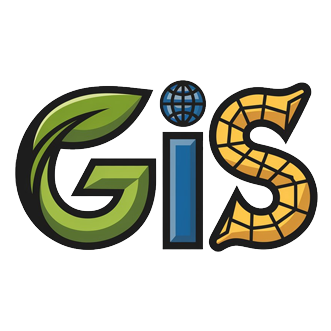

  
  | [English](README.md) | [中文](README-zh.md) |

# 🗺️ GIS-Club

> **We are developers who are passionate about GIS, doing some interesting GIS research together, welcome to join us.**

## 📋 About Us

GIS-Club is a community of passionate developers and researchers dedicated to advancing Geographic Information Systems (GIS) technology and applications. We focus on exploring innovative GIS solutions, sharing knowledge, and building cutting-edge geospatial tools and applications.

## 🎯 Our Mission

- **Research & Innovation**: Conducting interesting GIS research and developing novel geospatial solutions
- **Knowledge Sharing**: Fostering a collaborative environment for GIS enthusiasts to learn and grow
- **Technology Advancement**: Pushing the boundaries of what's possible in geospatial technology
- **Community Building**: Creating a vibrant community of GIS professionals and enthusiasts

## 🛠️ Technology Stack

Our projects typically involve:

- **GIS Frameworks**: QGIS, ArcGIS, PostGIS, GeoServer
- **Programming Languages**: Python, JavaScript, C++, Java
- **Web Technologies**: Leaflet, OpenLayers, Mapbox, D3.js、Cesium
- **Data Processing**: GDAL, NumPy, Pandas, GeoPandas
- **Cloud Platforms**: AWS, Azure, Google Cloud Platform
- **Mobile Development**: React Native, Flutter for GIS applications

## 🚀 Current Focus Areas

- **Spatial Data Analysis**: Advanced analytics and visualization techniques
- **Web GIS Applications**: Interactive mapping solutions and dashboards
- **Machine Learning in GIS**: AI-powered spatial analysis and prediction
- **Open Source GIS**: Contributing to and building upon open geospatial tools
- **Real-time GIS**: Dynamic mapping and location-based services

## 🤝 Get Involved

We welcome developers, researchers, and GIS enthusiasts at all levels:

- **Join our discussions** on GIS topics and challenges
- **Contribute to projects** and share your expertise
- **Participate in research** initiatives and collaborative studies
- **Learn from peers** and share your knowledge with the community

## 📞 Contact & Connect

- **GitHub**: [GIS-Club Organization](https://github.com/gis-club)
- **Email**: tqtong612@gmail.com
- **Discussions**: Join our GitHub Discussions for ongoing conversations
- **Projects**: Explore our repositories for current research and development work

---

*"Geography is the key to understanding our world, and GIS is the tool that makes it possible."*

*Made with ❤️ by the GIS-Club community*
